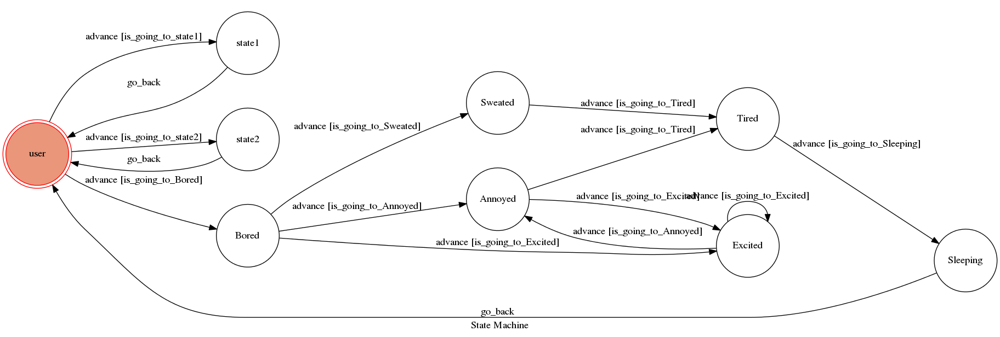

# TOC Project 2017

Template Code for TOC Project 2017

A telegram bot based on a finite state machine

## Finite State Machine


## 主題: 廢宅人生

幫助覺得無聊的廢宅決定接下來要做什麼事，減少他們因為不知所措所浪費的大量時間。

##執行:

需先使用`ngrok`取得URL，接著執行

```sh
python3 app.py
```

確定建立連結即可使用Telegram與ChatBot聊天

##如何互動:

The initial state is set to `user`.

Every time `user` state is triggered to `advance` to another state, it will `go_back` to `user` state after the bot replies corresponding message.

###state:

*user

*state1

*state2

*Bored

*Sweated

*Annoyed

*Excited

*Tired

*Sleeping

在進入`Bored`之後都會有''提示可以輸入的字串，除此之外也都會send一張圖片，其中`Excited`除了基本圖片還有提供音樂給使用者聆聽。

從`user`輸入"feel bored"後會進入`Bored`

*user

	*input: "feel bored" go to `Bored`

*Bored

	*input: "sail" go to `Sweated`

	*input: "study" go to `Annoyed`

	*input: "relax" go to `Excited`

*Sweated

	*input: "take a shower" go to `Tired`

*Annoyed

	*input: "study more" go to `Tired`

	*input: "relax" go to `Excited`

*Excited

	*input: "study" go to `Annoyed`

	*input: "relax" stay in `Excited`

*Tired

	*input: "sleep" go to `Sleeping`

*Sleeping

	*just go back `user`


## Author
[F74046496](https://github.com/F74046496)
